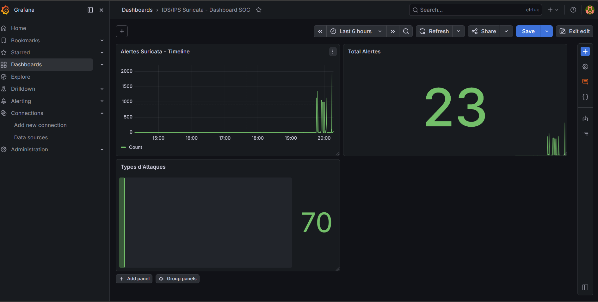
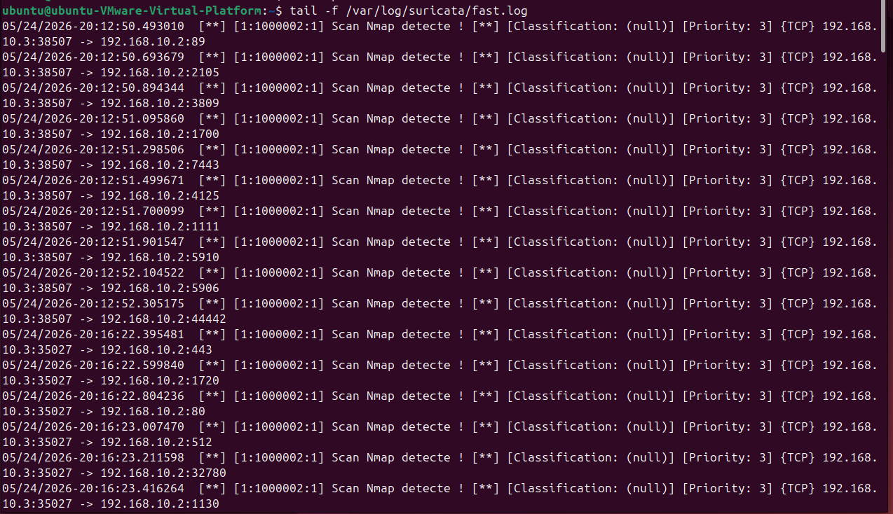
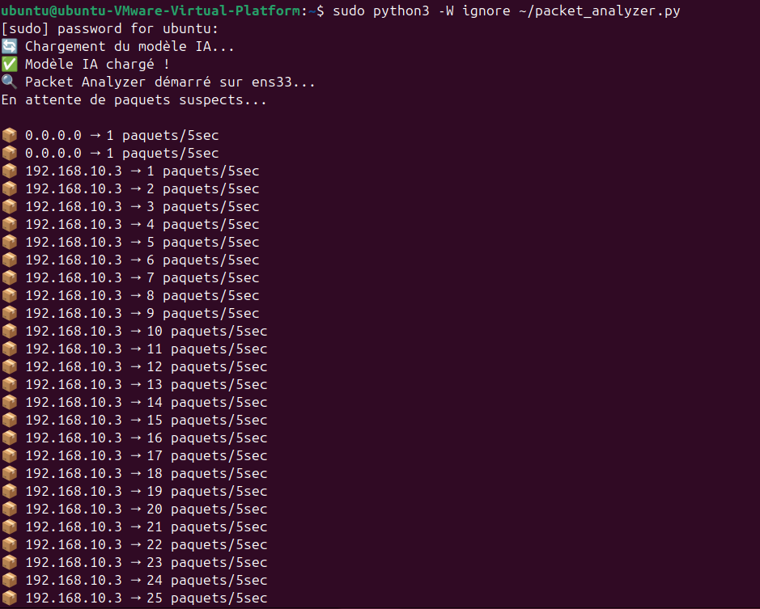
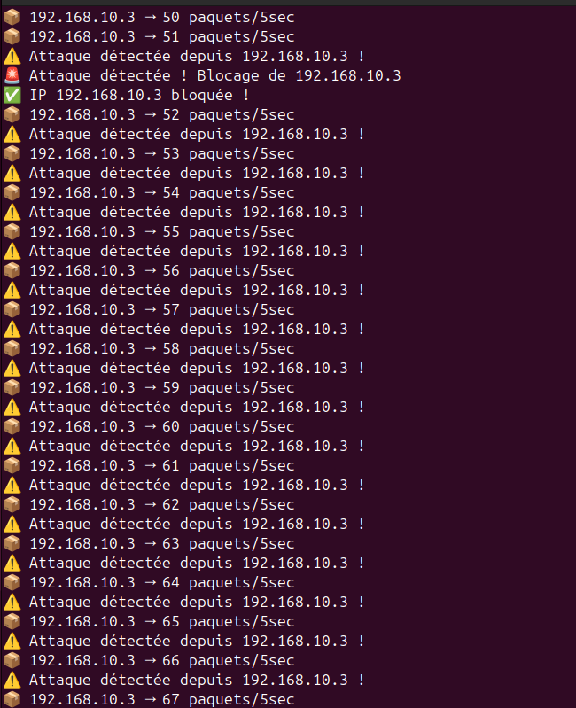
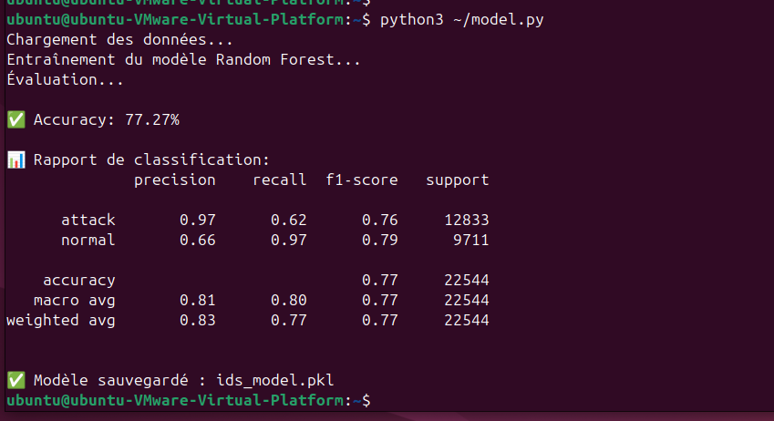

# 🛡️ IDS/IPS Intelligent Hybride

Système de détection et prévention d'intrusions combinant **Suricata** et **Intelligence Artificielle** pour identifier et bloquer automatiquement les attaques réseau en temps réel.

## 🏗️ Architecture
Kali (Attaquant)
↓
Scapy (Packet Analyzer)
↓
Suricata (Signature Engine) + Random Forest IA
↓
IPS Blocker (iptables)
↓
Logstash → Elasticsearch → Grafana Dashboard

## 🔧 Technologies utilisées

| Outil | Rôle |
|---|---|
| **Suricata** | IDS/IPS - Détection par signatures |
| **Python / Scapy** | Capture et analyse de paquets |
| **Random Forest** | Détection comportementale par IA |
| **Elasticsearch** | Stockage des alertes |
| **Logstash** | Transport des logs |
| **Grafana** | Dashboard SOC temps réel |
| **Kali Linux** | Simulation d'attaques |

## 📊 Résultats

- ✅ **50,185 règles** Suricata chargées
- ✅ **77.27% accuracy** du modèle IA
- ✅ **97% précision** sur la détection d'attaques
- ✅ Blocage automatique des IPs attaquantes

## 🚨 Attaques détectées

- Scan Nmap
- SSH Brute Force
- Ping Flood / ICMP
- Analyse comportementale anormale

## 📸 Screenshots

### Dashboard Grafana SOC


### Alertes Suricata en temps réel


### Packet Analyzer (Scapy)


### Détection et Blocage automatique


### Modèle IA - Random Forest


## 🚀 Lancement du projet

### 1. Démarrer les services
```bash
sudo systemctl start elasticsearch logstash grafana-server
sudo suricata -c /etc/suricata/suricata.yaml -i ens33
```

### 2. Lancer le Packet Analyzer + IA
```bash
sudo python3 -W ignore packet_analyzer.py
```

### 3. Lancer l'IPS Blocker
```bash
sudo python3 ips_blocker.py
```

### 4. Entraîner le modèle IA
```bash
python3 model.py
```
## 📋 Rapport de tests

### Environnement de test
| Machine | OS | Rôle |
|---|---|---|
| VM 1 | Kali Linux | Attaquant |
| VM 2 | Ubuntu 22.04 | IDS/IPS + Victime |

### Attaques testées et résultats

| Attaque | Outil | Détectée | Bloquée |
|---|---|---|---|
| Scan de ports | Nmap -sS | ✅ Oui | ✅ Oui |
| SSH Brute Force | Hydra | ✅ Oui | ✅ Oui |
| Ping Flood | ping -f | ✅ Oui | ✅ Oui |
| Scan UDP | Nmap -sU | ✅ Oui | ✅ Oui |

### Résultats du modèle IA

| Métrique | Valeur |
|---|---|
| Accuracy globale | 77.27% |
| Précision attaques | 97% |
| Précision normal | 66% |
| Dataset utilisé | NSL-KDD |
| Algorithme | Random Forest (100 arbres) |

### Conclusion
Le système IDS/IPS hybride a démontré une capacité efficace à détecter et bloquer automatiquement les attaques réseau en temps réel. La combinaison de Suricata pour la détection par signatures et du modèle Random Forest pour la détection comportementale offre une couverture complète contre les menaces connues et inconnues.

## 👩‍💻 Auteur

**Lembahej Manal & Kamali Chaimae** — 4CIR-G3-EMSI ANFA
